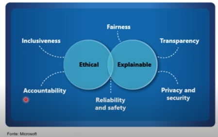

# Machine Learning

Modelos preditivos baseados em dados e estatísticas.

# Visão Computacional

Capacidades de IA para interpretar o mundo visualmente por meio de câmeras, vídeos e imagens.

Monitoramento de vídeos, reconhecimento facial, reconhecimento de documentos, segurança, diversos setores ganham com esse fator

# Processamento de Linguagem Natural

Capacidades da IA para que um computador interprete a linguagem escrita ou falada e responda adequadamente.

Análise de sentimentos, captar oque está sendo escrito em uma mensagem e definir se é ou não ofensiva, analisar as preferências do usuários para melhores anúncios, entre outros

# Inteligência de Documentos

Capacidades de IA que lidam com o gerenciamento, processamento e uso de grandes volumes de dados encontrados em formulários e documentos.

Análise de documentos, transcrição de documento, interpretação de um documento

# Mineração de Conhecimento

Capacidades de IA para extrair informações de grandes volumes de dados muitas vezes não estruturados para criar um armazenamento de conhecimento pesquisável

## Ingerir

Adicionar dados (banco de dados, imagens, vídeos, entre outros)

## Enriquecer

Oque será feito com esses dados, e oque esses dados são (a finalidade desses dados)

## Explorar

Deixando as informações enriquecidas plausíveis de exploração (chatbots, entre outras soluções de IA)

Muito parecido com input processing e output, fluxo padrão na programação

# IA Generativa

Recursos de IA que criam conteúdo original em vários formatos, incluindo linguagem natural, imagemm código e muito mais.

Uma IA que realmente aprende, onde é vista a linguagem natural.

    Ex.: Grok, Claude, ChatGPT, Gemini, Midjourney

# Imparcialidade

## Desafio ou Risco

1. O preconceito pode afetar os resultados.

## Exemplo

1. Um modelo de aprovação de empréstimos que discrimina por gênero devido ao preconceito nos dados com os quais foi treinado.

# Confiabilidade e Segurança

## Desafio ou Risco

1. Erros podem causar danos.

## Exemplo

1. Um veículo autônomo sofre uma falha no sistema e causa uma colisão.

# Privacidade e segurança

## Desafio ou Risco

1. Dados privados podem ser expostos.

## Exemplo

1. Um veículo autônomo sofre uma falha no sistema e causa uma colisão.
