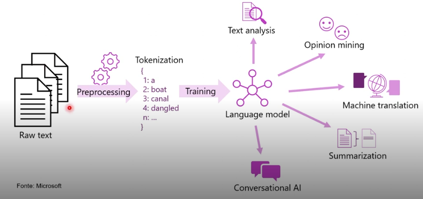

# Processamento de Linguagem Natural

- Conceitos de processamento de linguagem natural

- Capacidades de processamento de linguagem natural do Azure

### Objetivos de Aprendizado

- Reconheça quando o processamento de linguagem natural e IA conversacional podem ser usados.

## Oque é?

**Fluxo abaixo:**

Análise de sentimentos conectando músicas à filmes, escolhendo os anúncios corretos, é utilizado para captar a personalidade do usuário e mantê-lo na aplicação

- Mineração de Opinião
- Tradução à maquina
- Sumarização
- IA Conversacional

## Processamento de Linguagem Natural e IA Conversacional da Azure